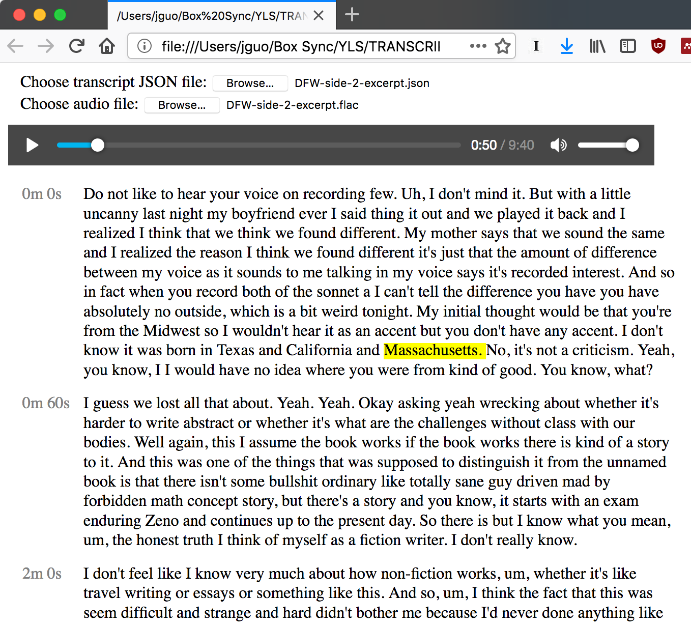

# simple-transcribe
The worst part of being a reporter is having to transcribe hours and hours of tape. Most of the time you save time by taking rough notes, going back to the tape only to transcribe key quotes. But if you need that full transcript — because you couldn't take notes in the field, or you're publishing the exchange verbatim — an hour of tape can easily require five or more hours of typing.

Meanwhile, Google's machine learning speech recognition project has been producing eerily accurate results. An April 2018 update introduced some [enhanced models](https://cloud.google.com/speech-to-text/) that added automatic punctuation and further increased accuracy. There's also a new model specificially for processing phone calls, which are filtered and compressed.

Most importantly, this service is cheap. You get 60 free minutes each month. After that, Google charges 2.4 cents per minute — that's $1.44 to transcribe an hour of audio. If you're a new customer, you also get a $300 credit your first year.

So why aren't more journalists using this service? I think it's because Google isn't really aiming this at end users, so the service is a bit fiddly to set up. The output isn't immediately human-readable. Also, the documentation is a little confusing and bleeding edge. Hopefully this example script and parser will demonstrate a slightly less painful way to make all of this work.

This project has two files. First, there is a Python script that submits your speech recogintion job to Google, and write the results to a local JSON file. You can then feed that JSON file into the parser (which is just an HTML file with some javascript), which will sync the transcript with your audio file.

Obviously the results are not perfect, but I was surprised at how good this technology has gotten recently. It's a cheap way to get a rough transcript right away. 

## Screenshots / Demo
See the Samples folder for some sample transcript results. 

This is a clip from Caleb Crain's 2003 [interview](http://www.steamthing.com/2013/07/audio-files-of-my-2003-interview-with-david-foster-wallace.html) with David Foster Wallace:

This is a clip from the [Still Processing](https://www.nytimes.com/podcasts/still-processing) podcast's episode of Asian Americans:

## Getting started
1. Sign up for Google Cloud services: [https://cloud.google.com/](https://cloud.google.com/). There's a free tier with about 60 minutes of free audio transcription per month, as well as a $300 credit your first year. 

2. Create a new project. See documentation for [instructions.](https://cloud.google.com/resource-manager/docs/creating-managing-projects#Creating%20a%20Project)

3. Enable the Google Cloud Speech API, and enable data logging (so that you can use the enhanced recognition models). See [instructions](https://support.google.com/cloud/answer/6158841?hl=en).

4. Create an API key for your new project. See [instructions](https://cloud.google.com/docs/authentication/api-keys). This is technically not recommended (there are more secure ways to authenticate), but it's the simplest.

5. Create a Google Cloud Storage bucket to hold your audio. See [documentation](https://cloud.google.com/storage/).

6. Turn your audio recording into a FLAC file (Audacity works great). Take note of the sample rate. If you have a stereo recording, mix it down to mono. (The service only works with single channel audio right now.)

7. Upload the audio recording onto your Google Cloud Storage bucket, and make it public. (Again, not the best security practice, but this is a fast way to get started.) 

## Configuring the script
1. Enter your API key into the script.

2. Enter the path to your audio recording. This is of the format: "gs://[your-bucket-name]/[your-filename]"

3. Enter the sample rate of the audio file

4. Select the model you want to use ("phone\_call", "video", "command\_and\_search", or "default"). See [descriptions here](https://cloud.google.com/speech-to-text/docs/reference/rest/v1p1beta1/RecognitionConfig#top_of_page). The phone call model is for low-quality recorded phone calls. Video seems to work pretty well for recorded in-person interviews, but it costs more. 

Note 1: We're making the HTTP calls with [requests](http://docs.python-requests.org/en/latest/user/install/), so make sure that's installed. 

## Running the script
The script will initiate a long running audio recognition job using the Google Cloud HTTP interface. Then it will poll the job every 10 seconds until the speech recognition is finished. 

The result is a JSON file containing the transcript as well as timestamps for each word. You can feed this JSON file into the provided interface. 

## Using the HTML5 interface
For convenient viewing and editing of the JSON file, I made a parser that works locally. 

1. Open the HTML file in a modern version of Firefox or Chrome. 

2. Select the JSON file and the corresponding audio file, and the transcript will load. 

The transcript will be synced to audio. If you click on a word, the audio will jump to that location in the audio. 

Thanks the magic (and horrors?) of HTML5 contenteditable, you can also edit the transcript inside your browser, and it ... doesn't totally break. 

## Errors
If your configuration is wrong, the server will throw errors at you. Check the terminal for the response. 

Common errors:
1. The sample rate was entered incorrectly.
2. Your audio file wasn't set to public.
3. You didn't enable data logging.
4. You didn't mix down your stereo audio to mono.

## Notes
1. Yes I know Google supplies a Python library to do this, but I found it a little too complicated for my purposes. I just wanted the raw JSON response from the server. Also, the Python API wasn't super well documented. It's not clear how to access jobs that you already started, or to poll the server for progress updates. So instead, this script just makes POST and GET requests at Google.

2. I find that the audio is processed at about 4-5x realtime. So a 10 minute audio file should take about 2-3 minutes.

3. The longrunningrecognize service will accept audio files up to 80 minutes in length. 

